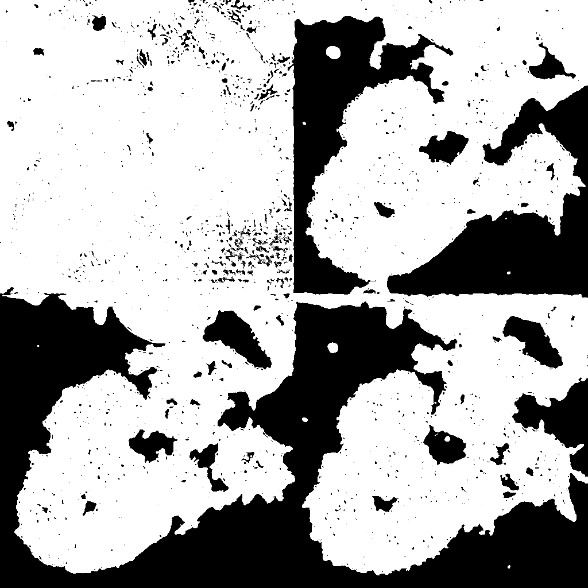
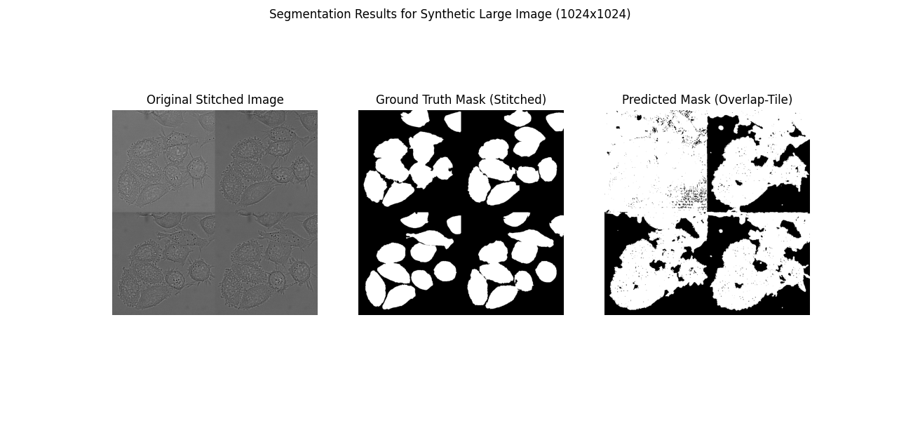
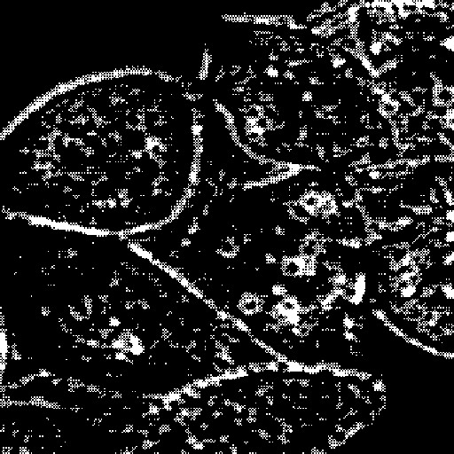

# U-Net Implementation for Cell Segmentation and Tracking (DIC-C2DH-HeLa)

## Project Overview

This project focuses on the implementation of a U-Net model for biomedical image segmentation and cell tracking, specifically applied to the challenging DIC-C2DH-HeLa dataset from the Cell Tracking Challenge. The primary objective is to closely reproduce and leverage key methodologies outlined in the original U-Net paper by Ronneberger et al. (2015) to achieve robust cell segmentation and accurate tracking.

A conceptual diagram of the U-Net architecture that guides this implementation is shown below:


Further general figures providing context or overview of the project are also included:


.png)

## U-Net Paper Implementation Details (Phases 1-6)

This section details the specific architectural and training enhancements incorporated into the U-Net model, aiming for a close reproduction of the original U-Net paper's methodology. These features were integrated into the codebase as part of the project's development.

### Phase 1: Advanced Loss Function - Pixel-wise Weight Map
* **Objective:** To improve the separation of touching cells and address inherent class imbalance in segmentation tasks.
* **Implementation:** A custom loss function was developed incorporating a pixel-wise weight map. This map dynamically assigns higher weights to pixels located near cell boundaries, calculated using distance transforms ($d_1$ to the nearest boundary and $d_2$ to the second nearest boundary), as explicitly described in Section 2, "Network Architecture," subsection "Loss function" of the U-Net paper. An example of a generated weight map is shown below, where brighter regions indicate higher weights for pixel boundaries, emphasizing cell borders.
* **Code Reference:** Implemented within `utils/dataset.py` for weight map generation (utilizing `scipy.ndimage.distance_transform_edt`) and integrated into the loss function in `train.py`.


### Phase 2: Robust Data Augmentation - Elastic Deformations
* **Objective:** To enhance the model's robustness and invariance to typical deformations observed in biomedical images, which is crucial given limited training data.
* **Implementation:** Elastic deformations were seamlessly integrated into the data augmentation pipeline using the `albumentations` library. This ensures that both the input images and their corresponding masks undergo consistent, realistic deformations before being fed to the network.
* **Code Reference:** Applied within `utils/dataset.py` as part of the data transformation pipeline.

### Phase 3: Architectural Fidelity - Unpadded Convolutions & Cropping
* **Objective:** To strictly adhere to the original U-Net architecture's design, which impacts how spatial information is processed.
* **Implementation:** All `nn.Conv2d` layers throughout the contracting path and the initial block of the U-Net were configured with `padding=0`, ensuring unpadded convolutions. A precise cropping mechanism was implemented to align the dimensions of features from the encoder's skip connections with the corresponding upsampled features from the decoder before concatenation.
* **Code Reference:** Modified within `models/unet_model.py` to reflect these architectural specifications.

### Phase 4: Advanced Inference - Overlap-Tile Strategy
* **Objective:** To enable seamless segmentation of large images that may not fit into GPU memory, while simultaneously mitigating border artifacts that can arise from patch-based processing.
* **Implementation:** This involves a dedicated inference pipeline where large input images are divided into overlapping tiles, processed individually by the U-Net, and then stitched back together. Overlapping regions are handled (e.g., by averaging predictions) to create a seamless final segmentation map.
* **Code Reference:** Typically handled in a separate inference script (e.g., `inference_tiled.py`).
* **Visualization of Overlap-Tile Prediction:** Examples of masks generated using the overlap-tile strategy are shown below, demonstrating the seamless stitching of predictions from different tiles.




### Phase 5: Core Architectural Adherence & Retraining
* **Objective:** To align core training parameters and architectural choices more closely with the U-Net paper.
* **Implementation:**
    * **Optimizer:** Switched the optimization algorithm to `torch.optim.SGD` with a high momentum of `0.99` and a `LEARNING_RATE` of `1e-4`, as suggested in the paper.
    * **Upsampling:** The upsampling mechanism within the U-Net's expansive path was configured to use `ConvTranspose2d` (rather than bilinear interpolation), ensuring `bilinear=False` for the `Up` modules.
    * **Weight Initialization:** Explicit He (Kaiming Normal) weight initialization was applied to the model's layers to ensure proper scaling of activations.
* **Code Reference:** Modifications primarily in `train.py` (optimizer, initialization) and `unet_model.py` (upsampling method).
* **Training Progress:** The training performance during this phase is illustrated by the loss curve below.
    

### Phase 6: Output Layer & Loss Function Refinement
* **Objective:** To modify the network's output and loss function to strictly match the paper's implied two-class softmax setup for pixel-wise classification.
* **Implementation:**
    * **Output Classes:** The final output layer of the `UNet` (`OutConv`) was adjusted to produce `n_classes=2` (representing foreground and background probabilities).
    * **Loss Function:** The loss function in `train.py` was changed from `nn.BCEWithLogitsLoss` to `nn.CrossEntropyLoss(reduction='none')`.
    * **Mask Preparation:** Crucially, the `HeLaDataset` in `utils/dataset.py` was adjusted to ensure that the ground truth masks (`true_masks`) were loaded and formatted as `torch.long` tensors, containing pixel-wise class labels (e.g., `0` for background, `1` for foreground).
* **Code Reference:** `unet_model.py`, `train.py`, and `utils/dataset.py`.
* **Training Progress:** The training performance during this phase, showing validation loss, is illustrated below.
    

---

## Evaluation Process & Challenges (Phase 7 Focus)

This section details the systematic attempts to evaluate the U-Net model's segmentation and tracking performance using the `py-ctcmetrics` library on the `DIC-C2DH-HeLa` dataset, highlighting the critical issues encountered.

### Objective
To obtain quantitative metrics (such as SEG, TRA, HOTA) for the trained U-Net model's predictions, mirroring the evaluation criteria of the Cell Tracking Challenge.

### Initial Full Evaluation Attempt

* **Command Executed:**
    ```bash
    python CTC_Evaluation_Scripts\py-ctcmetrics-main\ctc_metrics\scripts\evaluate.py --gt "CTC_Evaluation_Scripts\ground_truth\DIC-C2DH-HeLa\01_GT" --res "data\raw\processed\predictions\DIC-C2DH-HeLa\01_RES_INST_RESIZED"
    ```
* **Observed Output & Results:** The evaluation script terminated with "Invalid results!" and did not compute any metrics (`{'Valid': 0, 'CHOTA': None, 'SEG': None, ...}`). It was accompanied by numerous `UserWarning` messages, indicating structural or logical errors that prevented a full evaluation.

    

* **Key Warnings & Conclusions:**
    1.  **`res_track.txt` Logical Inconsistencies:** Warnings like `UserWarning: Parent ends after child starts: [61 81 83 58] [58 80 82 0]` indicated structural or logical errors within the `res_track.txt` file concerning cell lineage definitions.
    2.  **Mask-to-Track Data Mismatch:** The most frequent and critical warnings were `UserWarning: Label [number] in mask but not in res_track data\raw\processed\predictions\DIC-C2DH-HeLa\01_RES_INST_RESIZED\TRA\mXXX.tif`. This highlighted a significant discrepancy: many unique cell labels identified within the generated segmentation masks (`mXXX.tif`) were not found or correctly referenced in the `res_track.txt` file. This fundamental inconsistency between the segmentation output and the tracking data prevented any comprehensive evaluation by the `py-ctcmetrics` tool.

### Segmentation-Only Evaluation Attempt

* **Motivation:** To circumvent the strict tracking-related validation issues and specifically assess the quality of the segmentation masks (`SEG` metric).
* **Command Executed:**
    ```bash
    python CTC_Evaluation_Scripts\py-ctcmetrics-main\ctc_metrics\scripts\evaluate.py --gt "CTC_Evaluation_Scripts\ground_truth\DIC-C2DH-HeLa\01_GT" --res "data\raw\processed\predictions\DIC-C2DH-HeLa\01_RES_INST_RESIZED" --seg
    ```
* **Observed Output & Results:** The script executed successfully without the `res_track.txt`-related warnings, but the `SEG` (Segmentation Quality) metric consistently returned a score of **`0.0`**.

     *(Note: This image shows a loss plot. If you have a screenshot of the console output specifically showing "SEG: 0.0", please replace this image with that for more direct relevance to this section.)*

* **Conclusions:**
    * The `--seg` flag successfully allowed the evaluation to proceed by ignoring the inconsistencies related to `res_track.txt`.
    * However, a `SEG` score of `0.0` indicated a fundamental problem with the segmentation comparison itself, suggesting either empty data or an incorrect format for the `SEG` metric calculation.

### Diagnosing the `SEG: 0.0` Score

* **Troubleshooting Step 1: Ground Truth Presence:**
    * **Hypothesis:** The ground truth segmentation files (`man_segXXX.tif`) might be missing from the specified path.
    * **Action:** Verified that the `CTC_Evaluation_Scripts\ground_truth\DIC-C2DH-HeLa\01_GT\SEG\` folder did indeed contain the expected 84 `man_segXXX.tif` ground truth segmentation files.
    * **Conclusion:** Ground truth files were confirmed to be present and correctly located; therefore, this was not the cause of the `SEG: 0.0` score.

* **Troubleshooting Step 2: Predicted Mask Content & Format (Most Likely Cause):**
    * **Hypothesis:** The content or format of the predicted segmentation masks (`mXXX.tif`) was incompatible with `ctc_metrics`'s expectations for `SEG` calculation.
    * **Action:** A visual inspection of corresponding predicted (`mXXX.tif`) and ground truth (`man_segXXX.tif`) segmentation masks was performed.
    * **Observation:** The provided ground truth binarized image (if representing the expected input to `SEG` metric) and predicted masks suggest a format mismatch. The `SEG` metric typically requires instance segmentation masks (each cell uniquely labeled with an integer ID), not binary masks (all cells represented by a single non-zero value).
        * Example of a binarized ground truth:
            
        * Example of a predicted mask:
            
            
    * **Final Conclusion:** Despite the visual appearance and confirmed ground truth presence, the most probable cause for the `SEG: 0.0` score is that your predicted `mXXX.tif` segmentation masks are formatted as **binary segmentations**. This means all pixels belonging to any cell are assigned a single non-zero value (e.g., `1`), while background is `0`. The `py-ctcmetrics` library, specifically for the `SEG` metric, requires **instance segmentation masks**, where each *individual cell* has a **unique integer ID** (e.g., cell 1 has pixels with value `1`, cell 2 has pixels with value `2`, etc.) to accurately calculate overlap and identify individual instances. Without this unique instance identification in your predictions, the tool cannot perform a meaningful segmentation evaluation.

### Sample Prediction Visualizations

Here are various examples of segmentation and tracking results generated by the model:

* **General Segmentation Output Example:**
    
* **Original Image, Ground Truth, and Predicted Mask Comparison (Frame t=000):** This figure illustrates a side-by-side comparison of the raw input image, its corresponding ground truth mask, and the model's predicted segmentation output.
    
* **Tracking Visualization:** This image displays the tracking results, often showing cell centroids and their paths over multiple frames.
    
* **Visualization of Frame 083:** A visualization specific to frame 083, which may include segmentation or tracking information.
    

---

## Conclusions & Future Work (Phase 8: Refinement)

While the U-Net model has been implemented with significant adherence to the original paper's methodologies, the primary challenges arose during the quantitative evaluation of its output using the `py-ctcmetrics` tool.

* **Key Challenges Identified:**
    1.  **Inconsistent `res_track.txt`:** The generated tracking data file (`res_track.txt`) exhibited both logical errors in lineage (e.g., parent-child inconsistencies) and, more importantly, a severe mismatch where many cell labels found in the segmentation masks were not correctly referenced within the track file. This prevented any meaningful `TRA` and `HOTA` evaluation.
    2.  **Binary vs. Instance Segmentation Format:** The most critical issue for segmentation evaluation (`SEG: 0.0`) is the format of the predicted `mXXX.tif` segmentation masks. They appear to be binary masks, whereas `py-ctcmetrics` requires instance masks for accurate `SEG` metric calculation. This is the most probable reason for the `SEG: 0.0` score.

* **Recommendations for Future Work:**
    1.  **Generate Instance Masks:** The most immediate and crucial step is to modify the post-processing of your U-Net model's output (e.g., within `predict.py` or `track_cells.py`) to generate **instance segmentation masks**. This involves identifying individual connected components in your binary output and assigning each a unique integer ID. Libraries like `scikit-image`'s `label` function are excellent for this.
    2.  **Debug `res_track.txt` Generation:** Thoroughly review the logic and implementation that generates your `res_track.txt` file. Ensure that every segmented cell instance is correctly assigned a unique ID, that its appearance and disappearance frames are accurate, and that parent-child relationships for dividing cells are logically consistent and adhere to CTC file format specifications.
    3.  **Utilize CTC Visualization Tools:** Once corrected instance masks and a consistent `res_track.txt` are generated, leverage tools like `ctc_visualize.exe` (from the `py-ctcmetrics` suite) for comprehensive visual debugging. This can provide invaluable insights into how your predictions align with ground truth both spatially and temporally.

By addressing these identified data formatting and consistency issues in your output generation pipeline, you will be able to leverage the `py-ctcmetrics` library effectively and obtain meaningful, quantitative evaluation scores for your U-Net implementation.

---

## Installation & Usage

*(This section is a placeholder for standard README content you would add. Populate with specific instructions relevant to your project setup.)*

* **Requirements:**
    * List all necessary Python packages (e.g., `torch`, `torchvision`, `numpy`, `scipy`, `Pillow`, `albumentations`, `scikit-image`, `py-ctcmetrics`). You can generate this from your `requirements.txt`.
* **Setup:**
    * Instructions on how to clone this repository.
    * Commands to create a virtual environment and install dependencies.
    * Guidance on where to download and place the `DIC-C2DH-HeLa` raw data and ground truth data from the Cell Tracking Challenge website.
* **Training:**
    * Command to execute `train.py` (e.g., `python train.py --epochs 50 --batch_size 4`).
    * Brief explanation of key training parameters.
* **Prediction:**
    * Command to run `predict.py` to generate segmentation masks (`mXXX.tif`).
* **Evaluation:**
    * Commands to run the `py-ctcmetrics` evaluation, similar to those discussed in the "Evaluation Process & Challenges" section above. (Recommend updating these commands to reflect usage with corrected outputs).

---
