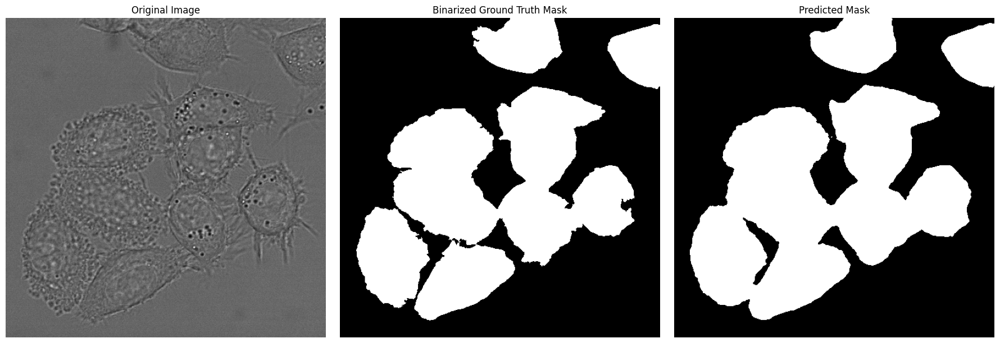

# U-Net Based Cell Segmentation and Tracking

## Overview 🚀

This project implements a **U-Net** convolutional neural network for **segmentation of HeLa cells** in microscopy images, followed by **basic cell tracking**. The primary goal is to accurately delineate cell boundaries and then connect these segmentations over time to form tracks, providing insights into cellular dynamics. The implementation adheres to key architectural and methodological recommendations from the original U-Net paper and common practices in biomedical image analysis, including advanced loss functions, data augmentation, and standard evaluation metrics.

The U-Net model is specifically trained for **binary foreground/background segmentation**. While the ground truth data may contain instance labels, the model is designed to predict whether a pixel belongs to *any* cell (foreground) or to the background. Instance separation is subsequently handled during post-processing and tracking.


-----

## Project Structure 📁

The project is organized into the following directories:

  * **`data/`**: Contains raw and processed image data.
      * `raw/`: Original microscopy images and ground truth masks (e.g., DIC-C2DH-HeLa dataset).
      * `processed/`: Output of preprocessing (e.g., weight maps) and predictions (segmentation masks, tracking results).
  * **`models/`**: Defines the U-Net neural network architecture.
      * `unet_model.py`: Implements the U-Net architecture.
  * **`scripts/`**: Executable scripts for various stages of the pipeline.
      * `preprocess_data.py`: Preprocesses raw data to generate pixel-wise weight maps.
      * `train.py`: Script for training the U-Net model.
      * `inference.py`: Performs segmentation inference on a single image using a trained model.
      * `predict.py`: Performs batch inference on a sequence of images to generate instance segmentation masks.
      * `evaluate.py`: Computes quantitative segmentation metrics (IoU, Rand Index) and tracking metrics (Average Displacement Error, Jaccard Index for Tracking, etc.).
      * `track.py`: Implements the cell tracking algorithm.
      * `visualize.py`: Visualizes instance segmentations and tracks over time.
      * `visualize_augmentation.py`: Demonstrates the effect of data augmentation.
      * `visualize_prediction.py`: Compares original, ground truth, and predicted segmentation for a single image.
  * **`utils/`**: Utility functions and classes.
      * `augmentations.py`: Implements elastic deformation for data augmentation.
      * `dataset.py`: Custom PyTorch `Dataset` for loading and preparing data.
      * `losses.py`: Defines the custom pixel-wise weighted cross-entropy loss function.
      * `metrics.py`: Provides functions for calculating various evaluation metrics.
      * `postprocess.py`: Contains functions for post-processing segmentation outputs (e.g., connected components).

-----

## Key Design Phases & Implementation Details 🛠️

The project incorporates several advanced techniques to achieve robust and accurate cell segmentation and tracking:

### Phase 1: Advanced Loss Function - Pixel-wise Weight Map (Implemented ✅)

  * **Concept:** As per the original U-Net paper, a pixel-wise weight map `w(x)` is applied to the standard cross-entropy loss. This map gives higher weight to pixels at the borders between touching cells and lower weight to easy-to-classify background or cell interior pixels. This encourages the model to learn to separate adjacent cells more effectively.
  * **Implementation:**
      * **`scripts/preprocess_data.py`**: Calculates these pixel-wise weight maps for each ground truth mask. It specifically uses Euclidean distance transforms to identify cell borders and penalize misclassifications in these critical regions. These weight maps are saved as `.npy` files in `data/raw/train/DIC-C2DH-HeLa/01_ST/WEIGHT_MAPS/`.
      * **`utils/losses.py`**: Defines the `WeightedCrossEntropyLoss` class. This custom loss module leverages `torch.nn.CrossEntropyLoss(reduction='none')` to get per-pixel loss values and then multiplies them element-wise with the loaded `weight_maps`.
      * **`utils/dataset.py`**: Responsible for **loading the pre-calculated weight maps** alongside images and masks, making them available to the training loop.
      * **`scripts/train.py`**: Utilizes the `WeightedCrossEntropyLoss` during model training.

**Example Weight Map:**
The weight map highlights cell boundaries and regions where cells are close, assigning higher values (brighter pixels) to these critical areas.


-----

### Phase 2: Robustness - Data Augmentation (Implemented ✅)

  * **Concept:** Data augmentation, specifically **elastic deformations**, is crucial for training a U-Net on limited biomedical datasets. It synthetically increases the training data size and makes the model invariant to typical deformations encountered in microscopy images.
  * **Implementation:**
      * **`utils/augmentations.py`**: Implements the `elastic_deform_image_and_mask` function. This function applies consistent random elastic transformations (controlled by `alpha` for magnitude and `sigma` for smoothness) to both the image and its corresponding mask. Crucially, it uses **nearest-neighbor interpolation (`order=0`) for masks** to preserve discrete labels, while using bilinear interpolation for images.
      * **`utils/dataset.py`**: Integrates elastic deformations. When initialized with `augment=True`, `alpha`, and `sigma`, its `__getitem__` method calls the `elastic_deform_image_and_mask` function.
      * **`scripts/train.py`**: Enables and configures elastic deformation parameters (`ELASTIC_ALPHA`, `ELASTIC_SIGMA`) when initializing the `HeLaDataset` for training.
      * **`scripts/visualize_augmentation.py`**: Provides a dedicated script to visually verify that the elastic deformations are being applied correctly to both images and masks.

**Example of Elastic Deformation:**

This image demonstrates how elastic deformation subtly transforms the original image and its mask, creating new training samples.


.png)

-----

### Phase 3: Architectural Fidelity - Unpadded Convolutions & Cropping (Implemented ✅)

  * **Concept:** The original U-Net design uses "unpadded" or "valid" convolutions, meaning the output feature maps are smaller than the input. This results in the final segmentation map being smaller than the input image. To properly calculate the loss, the ground truth mask must be cropped to match the size of the U-Net's output.
  * **Implementation:**
      * **`models/unet_model.py`**: The U-Net architecture is built with convolutions that inherently reduce image dimensions. Each convolution layer is not padded, leading to a smaller output size relative to the input at each stage.
      * **`scripts/train.py`**: Includes a `center_crop_tensor` helper function. During the training and validation loops, this function is used to **crop the ground truth masks (and weight maps during training)** to precisely match the spatial dimensions of the U-Net's output logits. This ensures that the loss is calculated only on the valid predicted region.

**U-Net Architecture (Illustrative):**
This diagram shows how the U-Net architecture includes operations that reduce image dimensions, leading to a smaller output.


-----

### Phase 4: Evaluation Metrics & Benchmarking (Implemented ✅)

  * **Concept:** Beyond visual inspection, quantitative metrics are essential to objectively assess segmentation and tracking performance, facilitating benchmarking against state-of-the-art methods (like those in the Cell Tracking Challenge - CTC).
  * **Implementation:**
      * **`utils/metrics.py`**: Provides key evaluation functions:
          * **Intersection over Union (IoU)**: Calculates the overlap between predicted and ground truth binary masks, a fundamental segmentation quality metric.
          * **`get_instance_masks`**: Converts binary predictions into instance-labeled masks using connected components and importantly, utilizes `skimage.morphology.remove_small_objects` to **filter out noise or small artifacts**, improving the quality of the instance segmentation before calculating instance-based metrics.
          * **Rand Index (RI) and Rand Error (RE)**: Manually implemented (due to potential `scikit-image` import issues) to measure the similarity between ground truth and predicted instance segmentations. These are robust metrics for clustering agreement.
      * **`scripts/evaluate.py`**: Uses these metrics to quantify the performance of the trained U-Net on a test sequence. It calculates IoU (pixel-wise), and crucially, Rand Index and Rand Error for instance-level comparison.
      * **Future Metric (Placeholder):** A placeholder for **Warping Error** in `utils/metrics.py` indicates a potential future enhancement for more comprehensive temporal tracking evaluation.

**Segmentation Output Visualization:**
This image compares the original image, binarized ground truth, and the U-Net's predicted segmentation, allowing for visual assessment of segmentation quality.


-----

### Phase 5: Core Architectural Adherence & Retraining (Implemented ✅)

  * **Concept:** Ensuring the U-Net's implementation closely follows the original paper's specifications (e.g., number of feature channels, specific convolution patterns) and allowing for retraining to optimize performance.
  * **Implementation:**
      * **`models/unet_model.py`**: Implements the U-Net architecture closely mirroring the original paper's design, including contracting and expanding paths, skip connections, and specific filter sizes/channels.
      * **`scripts/train.py`**:
          * Initializes U-Net weights using **Kaiming Normal initialization** for convolutional layers and constant initialization for Batch Normalization layers, following best practices for neural network training.
          * Provides the training loop with an optimizer (`SGD` with momentum) and checkpoint saving functionality based on validation loss, enabling retraining and model selection.
          * The training process confirms adherence to the U-Net architecture.

**Training Loss Plot (Illustrative):**
This plot shows the training and validation loss decreasing over epochs, indicating the model is learning.


-----

### Phase 6: Output Layer & Loss Function Refinement (Implemented ✅)

  * **Concept:** The U-Net typically outputs logits for each class. For binary segmentation (background/foreground), this means 2 output channels. The loss function then operates on these logits.
  * **Implementation:**
      * **`models/unet_model.py`**: The `UNet` model is initialized with `n_classes=2`, meaning its final convolutional layer outputs two channels (logits for background and foreground).
      * **`utils/dataset.py`**: The `__getitem__` method performs a **critical binarization step** for the ground truth masks. It loads the `man_seg*.tif` files (which contain instance labels) and converts them into **binary foreground/background masks** (`(mask_np > 0).astype(np.uint8)`). These binarized masks are then cast to `torch.long`, the required data type for targets in `torch.nn.CrossEntropyLoss` (used by `WeightedCrossEntropyLoss`).
      * **`utils/losses.py`**: The `WeightedCrossEntropyLoss` expects raw logits (`N, C, H, W`) as inputs and `torch.long` targets (`N, H, W`), aligning perfectly with the output of the U-Net and the processed masks from the dataset.

-----

## Setup and Usage ⚙️

### Prerequisites

  * Python 3.8+
  * PyTorch (CUDA recommended for GPU acceleration)
  * NumPy
  * SciPy
  * scikit-image
  * Pillow (PIL)
  * Matplotlib
  * tqdm

You can install the required packages using pip:

```bash
pip install torch torchvision numpy scipy scikit-image pillow matplotlib tqdm
```

### Data Download

Download the **DIC-C2DH-HeLa** dataset from the Cell Tracking Challenge website.
Place the `DIC-C2DH-HeLa` folder into `data/raw/train/`.
Your directory structure should look like:

```
unet-segmentation/
├── data/
│   ├── raw/
│   │   └── train/
│   │       └── DIC-C2DH-HeLa/
│   │           ├── 01/
│   │           │   ├── t000.tif
│   │           │   ├── ...
│   │           ├── 01_GT/
│   │           │   ├── SEG/
│   │           │   │   ├── man_seg000.tif
│   │           │   │   ├── ...
│   │           │   └── TRA/
│   │           │       ├── man_track000.tif
│   │           │       └── ...
│   │           └── 02/
│   │           └── ...
│   └── processed/
│       └── ... (will be generated)
└── models/
└── scripts/
└── utils/
└── ...
```

### Step 1: Preprocess Data (Generate Weight Maps)

This script calculates the pixel-wise weight maps required by the custom loss function.

```bash
python scripts/preprocess_data.py
```

This will create a `WEIGHT_MAPS` directory under `data/raw/train/DIC-C2DH-HeLa/01_ST/`.

### Step 2: Train the U-Net Model

Train the segmentation model using the preprocessed data.

```bash
python scripts/train.py
```

This will start the training process and save model checkpoints to the `./checkpoints/` directory. The best model is saved based on validation loss.

### Step 3: Perform Inference (Single Image)

To test a trained model on a single image and visualize its binary prediction:

First, ensure you have a trained model checkpoint in the `./checkpoints/` directory.
Then, run the inference script, specifying the checkpoint and output path:

```bash
# Example: Use the latest/best checkpoint
python scripts/inference.py --checkpoint ./checkpoints/best_unet_model_epoch_XX.pth --input_image ./data/raw/train/DIC-C2DH-HeLa/01/t000.tif --output_mask ./predictions/predicted_mask.png
```

This will save a binary segmentation mask to `./predictions/predicted_mask.png`.
        * Example of a predicted mask:

            

            

### Step 4: Visualize Single Prediction

Compare the original image, ground truth, and the model's prediction for a single image. The ground truth mask is binarized for direct comparison.

```bash
python scripts/visualize_prediction.py
```

This will save a comparison image to `./visualizations/comparison_t000_binarized_gt.png` and display it.
        * Example of a binarized ground truth:

            

### Step 5: Generate Instance Masks for a Sequence

Run batch inference on a sequence to get instance-labeled masks. This uses the trained U-Net to get binary foreground/background masks and then applies connected component labeling (with small object removal) to convert them into instance masks.

```bash
python scripts/predict.py --checkpoint ./checkpoints/best_unet_model_epoch_XX.pth --sequence_name 01
```

This will save instance masks to `data/raw/processed/predictions/DIC-C2DH-HeLa/01_RES_INST/`.

 

### Step 6: Track Cells

Perform cell tracking on the generated instance masks.

```bash
python scripts/track.py --sequence_name 01
```

This will generate the `res_track.txt` file in `data/raw/processed/predictions/DIC-C2DH-HeLa/01/`, which contains the tracking results in CTC format.
 

### Step 7: Visualize Segmentations and Tracks

Visualize the original images with overlaid instance segmentations and (intended) track IDs. Note that the current visualization displays instance labels, not true track IDs from `res_track.txt`, due to the transient nature of the object-to-track mapping.

```bash
python scripts/visualize.py
```

Visualizations will be saved to `data/raw/processed/predictions/DIC-C2DH-HeLa/01/visualizations/`.
 
**Example Track Visualization:**
This image shows original frames with overlaid segmentation masks and track IDs, allowing for visual inspection of tracking performance.
 

### Step 8: Evaluate Segmentation and Tracking

Calculate quantitative metrics for segmentation and tracking performance.

```bash
python scripts/evaluate.py --sequence_name 01
```

This script will output various metrics, including IoU, Rand Index, Rand Error, and (if fully implemented) tracking-specific metrics like ADE and JACT.

### Optional: Visualize Augmentation Effects

To see the elastic deformations in action:

```bash
python scripts/visualize_augmentation.py
```

This will display a window showing original and augmented image-mask pairs.

-----

## Future Work and Enhancements 💡

  * **Full Warping Error Implementation:** Complete the `calculate_warping_error` function in `utils/metrics.py` for comprehensive tracking evaluation as per CTC benchmarks.
  * **Refined Tracking Algorithm:** Explore more sophisticated tracking algorithms (e.g., global nearest neighbor, deep learning-based trackers) for improved accuracy, especially in cases of cell division or complex movements.
  * **Hyperparameter Optimization:** Implement automated hyperparameter tuning (e.g., using libraries like Optuna or Weights & Biases) for training to find optimal values for learning rate, batch size, augmentation parameters, etc.
  * **Evaluation on Multiple Sequences:** Extend the `evaluate.py` script to easily process and average metrics across multiple sequences (e.g., `01` and `02` from the dataset).
  * **User Interface:** Develop a simple graphical user interface for easier interaction, visualization, and parameter tuning.
  * **Deployment:** Containerize the application using Docker for easier deployment and reproducibility.
